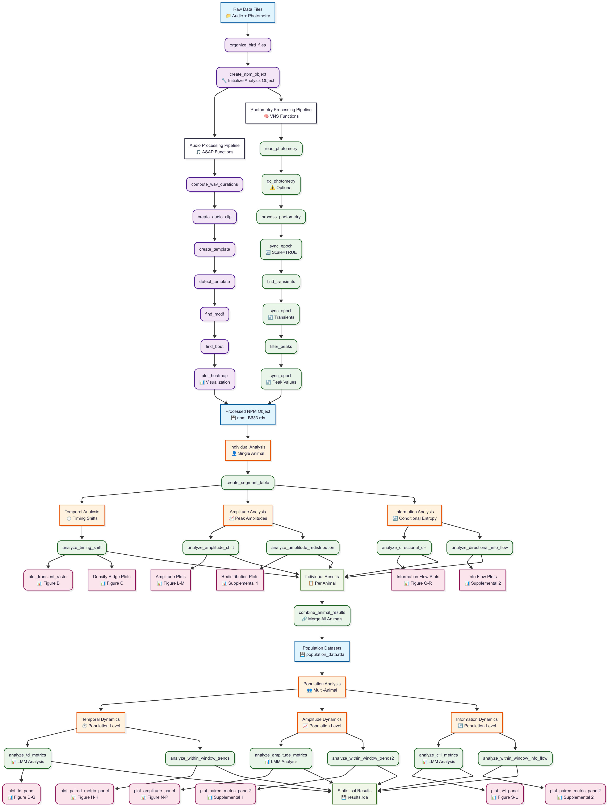

### Overview
------
Code repository demonstrating VNS package implementation for analyzing longitudinal fiber photometry recordings of dopamine dynamics in vocal basal ganglia circuits during juvenile songbird development.


### Installation
------
To reproduce the analyses, install the following R packages:
```{r, install_pkgs, eval = FALSE}
require(remotes)

# Install ASAP
remotes::install_github("LXiao06/ASAP")
# Or install local version
remotes::install_local("pkgs/ASAP_0.3.3.tar.gz", dependencies = TRUE)

# Install VNS
remotes::install_github("LXiao06/VocalNeuroSync")
# Or install local version
remotes::install_local("pkgs/VNS_0.0.0.9000.tar.gz", dependencies = TRUE)
```
For details, see the [ASAP GitHub repository](https://github.com/LXiao06/ASAP) and the [VocalNeuroSync repository](https://github.com/LXiao06/VocalNeuroSync).

### Tutorials
------
- [Data Processing](https://lxiao06.github.io/Juvenile_DA_analysis/data_processing.html)
  <br />
- [Individual Analysis](https://lxiao06.github.io/Juvenile_DA_analysis/individual_analysis.html)
  <br />
- [Population Analysis](https://lxiao06.github.io/Juvenile_DA_analysis/population_analysis.html)
  <br />

### Architecture Overview
------
**[Interactive Version of Analytics Architecture](https://lxiao06.github.io/Juvenile_DA_analysis/diagram/interactive-flowchart.html) :** - Explore the workflow with collapsible sections



