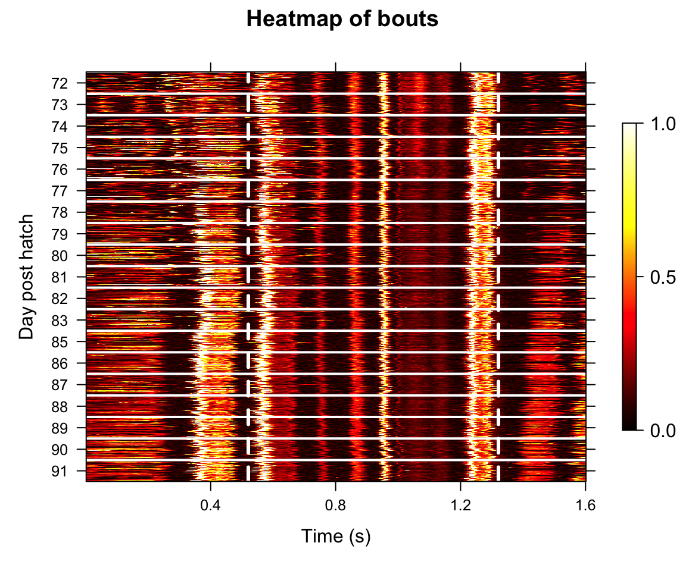
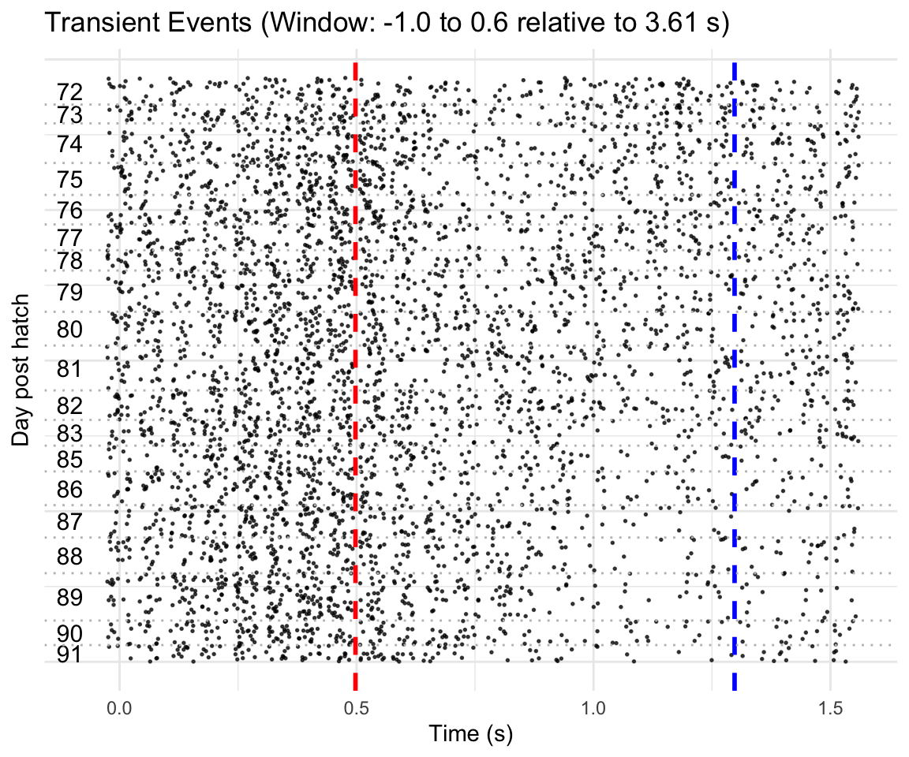
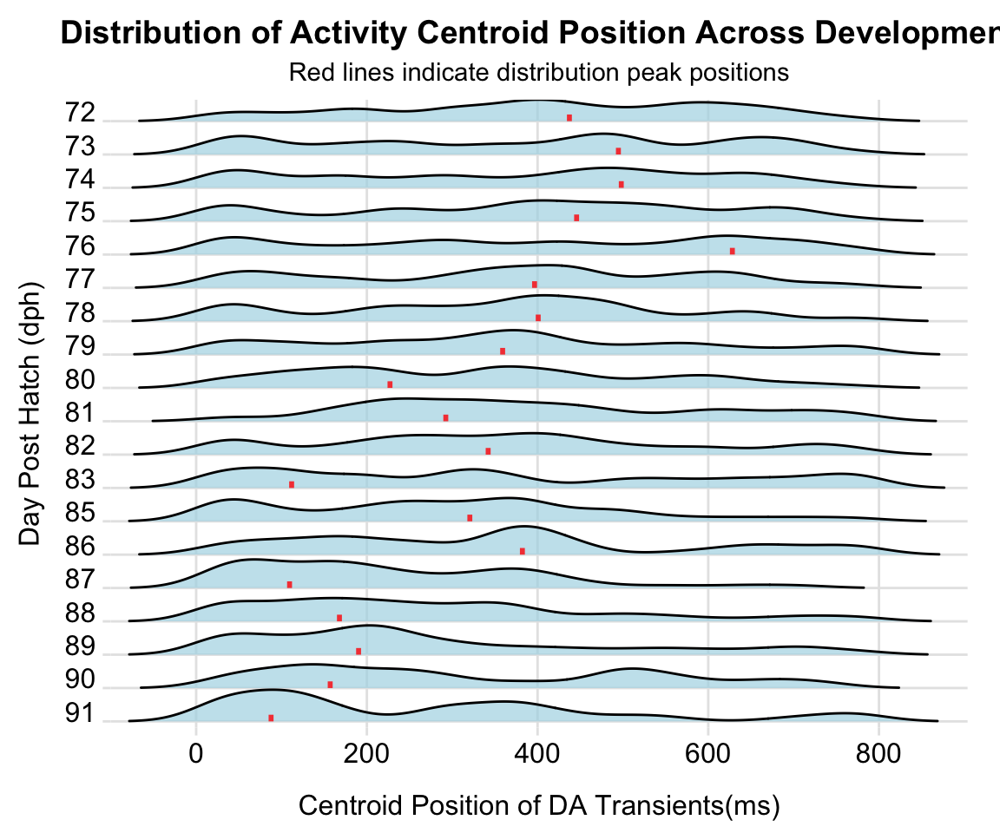
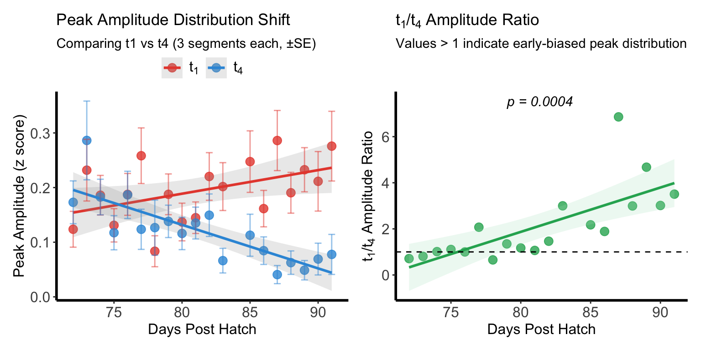
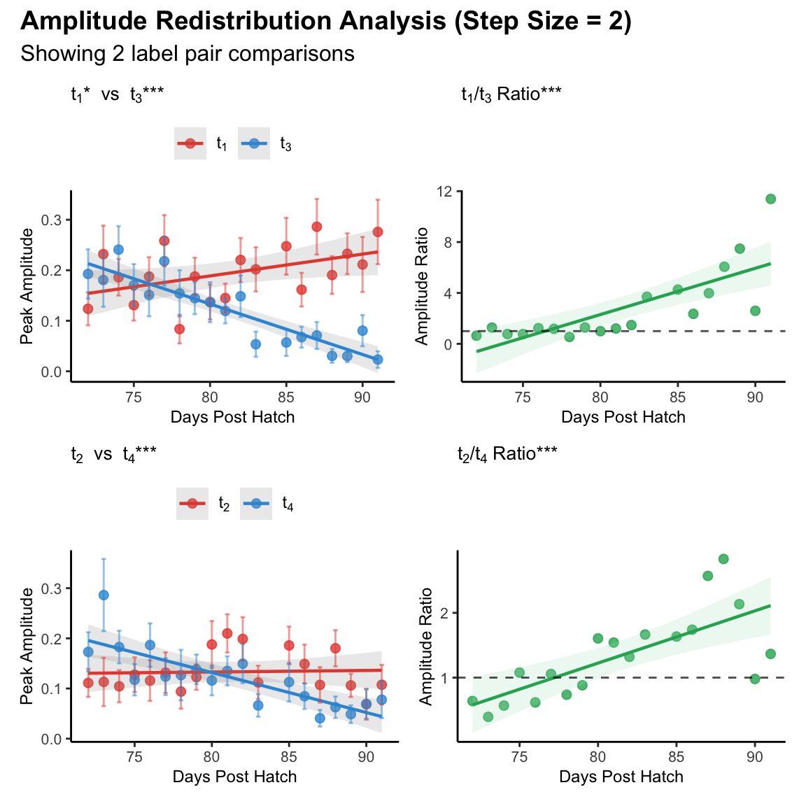
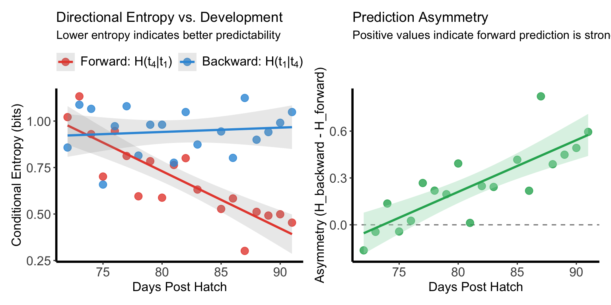
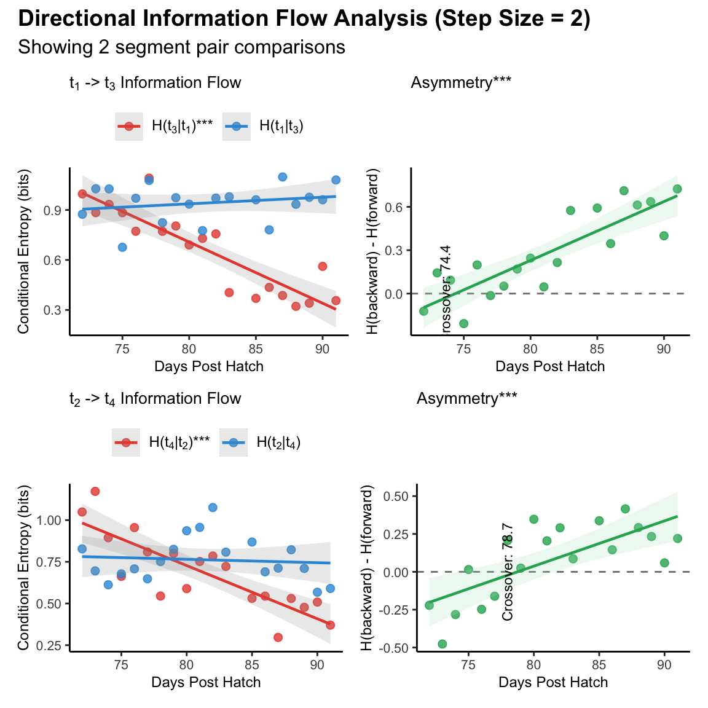

```{r setup, include = FALSE}
knitr::opts_chunk$set(echo = TRUE, warning = FALSE, message = FALSE)

# Global variable to control code evaluation and figure generation
EVAL <- FALSE  # Set to TRUE to switch to eval = TRUE, FALSE to use pre-generated images
```

\

## Overview

**This tutorial demonstrates individual-level analysis of processed fiber photometry dopamine data as well as song production from juvenile songbirds. The analysis examines dopamine transient patterns, peak amplitudes, and their relationship to vocal behavior development using the VNS and ASAP packages.**\
\

> ### Install Required Packages
>
> ```{r, install_pkgs, eval = EVAL}
> require(remotes)
> remotes::install_github("LXiao06/ASAP")
> remotes::install_local(file.path(getwd(),"pkgs", "VNS_0.0.0.9000.tar.gz"), 
>                       dependencies = TRUE)
> ```

## Load Packages

```{r, load_pkgs, eval = EVAL}
library("ASAP")
library("VNS")
```

\

## Load Processed Data

Load the npm object created from the data processing pipeline.

```{r, load_data, eval = EVAL}
npm <- readRDS("./data/npm_B633.rds")
```

\

## Visualize Song Development

### Figure A

Heatmap showing aligned amplitude envelopes of song recordings from an example bird during development (72-91 dph). Each row represents one epoch (50 epochs per dph). Dashed lines indicate motif onset and offset.

```{r, FigA, fig.width=6, fig.height=5, results='hide' ,eval = FALSE}
plot_heatmap(npm, segment_type = "bouts",
             balanced =T,
             window = c(1, 0.6),
             contrast = 6,
             reference_lines = c(-0.48, 0.32),
             ylabel = "Day post hatch",
             verbose = FALSE)
```

\

## Temporal Shift of Dopamine

### Figure B

Raster plot showing dopamine transients in individual epochs of the example bird. Red and blue vertical lines indicate motif onset and offset, respectively. Horizontal dashed lines delineate boundaries between days.

```{r, FigB, fig.width=6, fig.height=5, eval = EVAL}
plot_transient_raster(npm,
                      method = "epoch", window = c(-1, 0.6),
                      region = "reg0",
                      ref_line = c(-0.48,0.32),
                      point_size = 0.3,
                      jitter_height = 0.5,
                      ref_color = c("red" , "blue"),
                      ylab = "Day post hatch",
                      relative_time_axis = F)
```
<!--  -->

```{r, img1, echo=FALSE, eval=!EVAL}

```

\

### Figure C

Density ridge plots showing the distribution of centroid positions of dopamine transients for each dph of the example bird. Red bars indicate distribution peaks. Labels t₁-t₄ denote 200-ms segments spanning the motif window.

```{r, FigC, fig.width=6, fig.height=5, eval = EVAL}
segment_counts <- create_segment_table(npm,
                                       region ="reg0",
                                       window = c(-0.4, 0.4),
                                       n_segments= 12)
transient_shift <-  analyze_timing_shift(segment_counts,
                                         method = "centroid",
                                         segment_duration_ms = 67,
                                         bandwidth = 40,
                                         highlight_position ="mode",
                                         xlab = "Centroid Position of DA Transients(ms)")
```
<!--  -->

```{r, img2, echo=FALSE, eval=!EVAL}

```

\

## Amplitude Shift of Dopamine

### Figure L-M

Representative example showing classic TD learning amplitude shift pattern between early and late motif segments

(left) Peak amplitudes for early (t₁, red) and late (t₄, blue) time windows across development. Early amplitude increased significantly while late amplitude decreased significantly.

(right) Early/late amplitude ratio increased significantly across development.

```{r, FigL-M, fig.width=8, fig.height=4, eval = EVAL}
segment_tab <- create_segment_table(npm,
                                    region = "reg0",
                                    method = "epoch",
                                    data_type = "peak_aligned",
                                    window = c(-0.4, 0.4),
                                    n_segments = 12)

amplitude_shift <- analyze_amplitude_shift(segment_tab,
                                   output = "data.frame",
                                   segment_duration_ms = 67,
                                   segments_per_label = 3,      # Number of segments at each edge
                                   label_pair = c(1,4) )        # First and last 200ms
```
<!--  -->

```{r, img3, echo=FALSE, eval=!EVAL}

```

\

### Supplemental figure 1A-D

Representative example showing amplitude redistribution across different pairs of motif segment within 6 days' sliding window

(a) Peak amplitudes for early (t₁, red) and late (t₃, blue) segments across development. Early amplitude increased significantly while late amplitude decreased significantly.

(b) Early/late amplitude ratio (t₁/t₃) increased significantly across development.

(c) Peak amplitudes for early (t₂, red) and late (t₄, blue) segments showing developmental trajectory. Early amplitude showed no significant change while late amplitude decreased significantly.

(d) Early/late amplitude ratio (t₂/t₄) increased significantly across development.

```{r, Fig_sup1, fig.width=6, fig.height=6, eval = EVAL}
amplitude_redistribution <- analyze_amplitude_redistribution(segment_tab,
                                                         output = "list",
                                                         segment_duration_ms = 67,
                                                         segments_per_label = 3,
                                                         step_size = 2)
```
<!--  -->

```{r, img4, echo=FALSE, eval=!EVAL}

```

\

## Information Theory Analysis

### Figure Q-R

Representative example showing predictive coding development between early and late motif segments.

(left) Forward conditional entropy H(t₄\|t₁) (red) significantly decreased with development, indicating improved predictability of late events given early events. Backward conditional entropy H(t₁\|t₄) (blue) showed no significant change.

(right) Prediction asymmetry (H(t₁\|t₄) - H(t₄\|t₁)) significantly increased across development.

```{r, FigQ-R, fig.width=8, fig.height=4, eval = EVAL}
segment_counts <- create_segment_table(npm,
                                       region ="reg0",
                                       window = c(-0.4, 0.4),
                                       n_segments=4)
dev_res <- analyze_directional_cH(segment_counts,
                                  source_seg = 1,
                                  target_seg = 4)
```
<!--  -->

```{r, img5, echo=FALSE, eval=!EVAL}

```

\

### Supplemental figure 2A-D

Representative example showing shift of directional information flow across different pairs of motif segment within 6 days' sliding window 

(a) Conditional entropies for forward (H(t₃\|t₁), red) and backward (H(t₁\|t₃), blue) prediction across development. Forward entropy decreased significantly indicating improved predictability of t₃ from t₁, while backward entropy showed no significant change.

(b) Prediction asymmetry (H(t₁\|t₃) - H(t₃\|t₁)) increased significantly across development, with dominance crossover at DPH 74.4.

(c) Conditional entropies for forward (H(t₄\|t₂), red) and backward (H(t₂\|t₄), blue) prediction showing developmental trajectory. Forward entropy decreased significantly while backward entropy showed no significant change.

(d) Prediction asymmetry (H(t₂\|t₄) - H(t₄\|t₂)) increased significantly across development, with dominance crossover at DPH 78.7.

```{r, Fig_sup2, fig.width=6, fig.height=6, eval = EVAL}
dev_res  <- analyze_directional_info_flow(segment_counts, step_size = 2)
```
<!--  -->

```{r, img6, echo=FALSE, eval=!EVAL}

```

\

## Summary

This individual analysis successfully:

1.  **Visualized** song and dopamine transient patterns across development
2.  **Quantified** timing and amplitude of dopamine transients
3.  **Analyzed** temporal and amplitude shift of dopamine activity within song motif
4.  **Modeled** developmental trajectories of dopamine activity within song motif
5.  **Generated** comprehensive individual-level reports
6.  **Prepared** results for population-level analysis\
    \

## Session Info

```{r, echo = FALSE}
sessionInfo()
```
