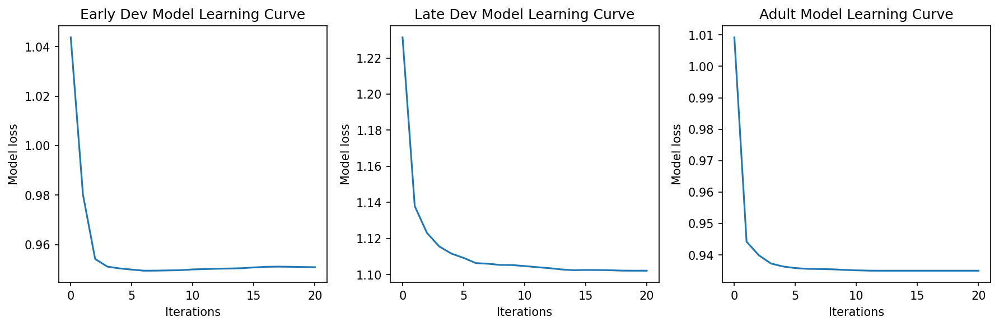
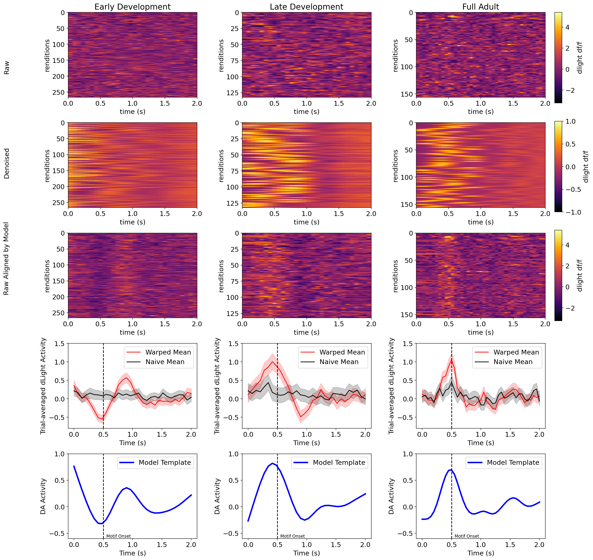
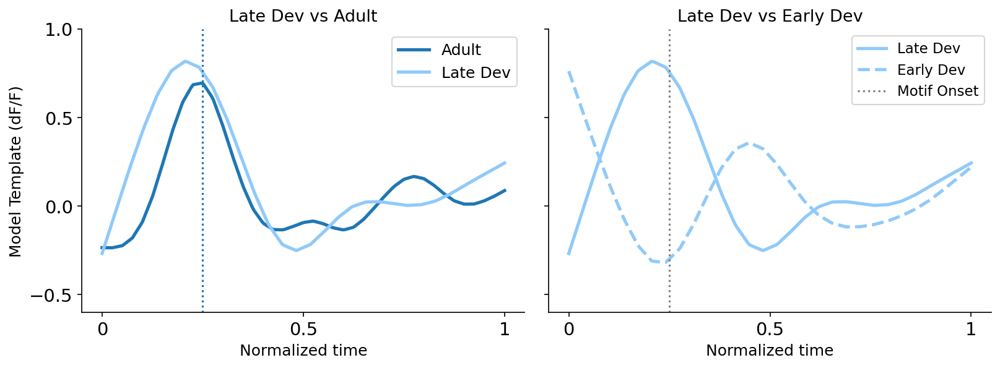

```{r setup, include = FALSE}
# Global variable to control code evaluation and figure generation
EVAL <- FALSE  # Set to TRUE to enable code execution; FALSE uses pre-generated images

knitr::opts_chunk$set(
  echo = TRUE,
  warning = FALSE,
  message = FALSE,
  python.reticulate = EVAL
)
```

\

## Overview

**This tutorial demonstrates the application of an unsupervised shift-only time warping model to pooled dLight fiber photometry recordings collected from juvenile songbirds at similar developmental stages (early and late development), and compares them to full-adult animals.**\
\

The analysis addresses key limitations of standard supervised alignment approaches and provides a more robust characterization of dopamine temporal dynamics across a population of animals.

> ### Why Shift-Only Time Warping?
>
> **Limitations of Supervised Approaches:**
>
> 1.  **Alignment subjectivity:** Manually selecting alignment points (e.g., motif onset) can be subjective and inconsistent across animals or renditions.
> 2.  **Averaging bias:** Trial-averaging after fixed alignment can mask fine-grained temporal jitter in dLight activity, obscuring true dynamics.
>
> **Advantages of the Shift-Only Model:**
>
> 1.  **Unsupervised temporal discovery:** The model discovers precise temporal patterns without relying on pre-defined behavioral events.
> 2.  **Robustness to variability:** By not anchoring to behavioral events, the model naturally accommodates trial-to-trial variability, enabling inclusion of both directed and undirected singing data.
> 3.  **Applicable across data types:** Works on both raw dLight traces and detected transient events.

\

## Citation

This analysis relies on the `affinewarp` package, implementing piecewise linear time warping for multi-dimensional time series:

> Williams AH, Poole B, Maheswaranathan N, Dhawale AK, Fisher T, Wilson CD, Brann DH, Trautmann E, Ryu S, Shusterman R, Rinberg D, Ölveczky BP, Shenoy KV, Ganguli S (2020). **Discovering precise temporal patterns in large-scale neural recordings through robust and interpretable time warping.** *Neuron*, 105(2):246-259.e8. [https://doi.org/10.1016/j.neuron.2019.10.020](https://doi.org/10.1016/j.neuron.2019.10.020)

GitHub repository: [https://github.com/ahwillia/affinewarp](https://github.com/ahwillia/affinewarp)

\

## Install Required Packages

Install the `affinewarp` Python package before running this analysis:

```{python, install_pkgs, eval = FALSE}
# Install affinewarp from source
import subprocess
subprocess.run(["pip", "install", "git+https://github.com/ahwillia/affinewarp.git"], check=True)
```

Alternatively, clone the repository and install locally:

```{bash, install_local, eval = FALSE}
git clone https://github.com/ahwillia/affinewarp/
cd affinewarp
pip install .
pip install -r requirements.txt
```

\

## Setup

```{python, imports, eval = EVAL}
import numpy as np
from affinewarp import ShiftWarping
import matplotlib.pyplot as plt
import os

# %matplotlib inline

# Figure output directory
FIGURE_DIR = "./figs"
os.makedirs(FIGURE_DIR, exist_ok=True)
```

\

## Load Pooled dLight Data

Load the pooled dLight recordings for three groups. The data arrays are shaped
`(trials, time_bins, 1)`:

| Dataset | File | Window | Sampling |
|---|---|---|---|
| **Early development** | `early_dev_pool_2s.npy` | 2 s | ~66.7 ms/bin (30 bins) |
| **Late development** | `late_dev_pool_2s.npy` | 2 s | ~66.7 ms/bin (30 bins) |
| **Full adult** | `adult_pool_2s.npy` | 2 s | ~48.8 ms/bin (41 bins) |

> **Note:** The juvenile and adult datasets were recorded at different sampling rates, so each group's time axis must be constructed from its own bin count and window duration.

```{python, load_data, eval = EVAL}
# Juvenile recording parameters
JUV_TOTAL_WINDOW = 2.0   # total window (seconds)
JUV_MOTIF_ONSET  = 0.5   # pre-motif baseline (seconds)

# Adult recording parameters
ADULT_TOTAL_WINDOW = 2.0
ADULT_MOTIF_ONSET  = 0.5

DATA_DIR = "./data"

# Early development — pooled across animals
early_dev = np.load(os.path.join(DATA_DIR, "early_dev_pool_2s.npy"))  # (trials, bins, 1)

# Late development — pooled across animals
late_dev = np.load(os.path.join(DATA_DIR, "late_dev_pool_2s.npy"))    # (trials, bins, 1)

# Full adult
raw_adult = np.load(os.path.join(DATA_DIR, "adult_pool_2s.npy"))      # (trials, bins) or (trials, bins, 1)
if raw_adult.ndim == 2:
    raw_adult = raw_adult[:, :, np.newaxis]                            # -> (trials, bins, 1)

print(f"early_dev : {early_dev.shape}  | "
      f"{JUV_TOTAL_WINDOW * 1000 / early_dev.shape[1]:.1f} ms/bin")
print(f"late_dev  : {late_dev.shape}   | "
      f"{JUV_TOTAL_WINDOW * 1000 / late_dev.shape[1]:.1f} ms/bin")
print(f"raw_adult : {raw_adult.shape}  | "
      f"{ADULT_TOTAL_WINDOW * 1000 / raw_adult.shape[1]:.1f} ms/bin")
```

```{r, img_load_txt, echo=FALSE, eval=!EVAL}
cat("early_dev : (266, 30, 1)  | 66.7 ms/bin\nlate_dev  : (132, 30, 1)  | 66.7 ms/bin\nraw_adult : (156, 41, 1)  | 48.8 ms/bin")
```

\

## Fit Shift-Only Warping Models

A **ShiftWarping** model is fit independently to each group using the same
hyperparameters:

- `maxlag = 0.2` — maximum allowed shift is ±20% of the window duration
- `smoothness_reg_scale = 10.0` — regularization on template smoothness
- `iterations = 20` — number of alternating optimization steps

```{python, fit_models, eval = EVAL}
# Shared hyperparameters
MAXLAG           = 0.2
SMOOTHNESS_SCALE = 10.0
FIT_ITERATIONS   = 20

early_dev_model = ShiftWarping(maxlag=MAXLAG, smoothness_reg_scale=SMOOTHNESS_SCALE)
early_dev_model.fit(early_dev, iterations=FIT_ITERATIONS)

late_dev_model = ShiftWarping(maxlag=MAXLAG, smoothness_reg_scale=SMOOTHNESS_SCALE)
late_dev_model.fit(late_dev, iterations=FIT_ITERATIONS)

adult_model = ShiftWarping(maxlag=MAXLAG, smoothness_reg_scale=SMOOTHNESS_SCALE)
adult_model.fit(raw_adult, iterations=FIT_ITERATIONS)

print("All models fitted.")
print(f"  Early dev template shape : {early_dev_model.template.shape}")
print(f"  Late dev template shape  : {late_dev_model.template.shape}")
print(f"  Adult template shape     : {adult_model.template.shape}")
```

\

### Learning Curves

The loss (reconstruction error) should decrease monotonically over iterations.
Convergence before 20 steps indicates the model has found a stable solution.

```{python, learning_curves, fig.width=12, fig.height=4, eval = EVAL}
# Plot one learning-curve panel per model (matching the notebook's subplot layout)
model_list  = [early_dev_model, late_dev_model, adult_model]
model_names = ["Early Dev", "Late Dev", "Adult"]

fig, axes = plt.subplots(1, 3, figsize=(12, 4))
for ax, model, name in zip(axes, model_list, model_names):
    ax.plot(model.loss_hist)
    ax.set_xlabel("Iterations")
    ax.set_ylabel("Model loss")
    ax.set_title(f"{name} Model Learning Curve")

fig.tight_layout()
fig_path = os.path.join(FIGURE_DIR, "photometry_modeling_learning_curves.png")
fig.savefig(fig_path, dpi=150, bbox_inches="tight")
print(f"Saved: {fig_path}")
plt.show()
```

```{r, img_learning, echo=FALSE, eval=!EVAL}

```

\

## Main Visualization: Raw, Model Estimate, Aligned, Trial Average, and Template

The figure below presents, for each group (Early Development, Late Development,
Full Adult), five rows:

1. **Raw dLight** — unaligned fluorescence heatmap (trials × absolute time)
2. **Model estimate** — the model's reconstruction via `model.predict()`
3. **Shift-aligned raw** — raw traces reindexed by learned shifts
4. **Trial average** — naive mean (black) vs. shift-aligned mean (colored), with 95% CI ribbons
5. **Model template** — the consensus temporal profile (blue)

> **Note:** The adult data (Column 3) has 41 time bins over 2 s (~48.8 ms/bin),
> whereas the juvenile data have 30 bins over 2 s (~66.7 ms/bin). Time axes are
> absolute (0 to window duration); a dashed vertical line marks motif onset.

```{python, helper_funcs, eval = EVAL}
def get_clock_time(data, time_window):
    """Return absolute time array from 0 to time_window (seconds)."""
    return np.linspace(0, time_window, data.shape[1])


def plot_heatmap_col(ax, data, vmin, vmax, total_window, title=None, ylabel=None):
    """Plot a trials x time heatmap with inferno colormap."""
    hmap_kws = dict(aspect="auto", cmap="inferno",
                    extent=[0, total_window, data.shape[0], 0])
    im = ax.imshow(np.squeeze(data), vmin=vmin, vmax=vmax, **hmap_kws)
    ax.set_xlabel("time (s)")
    ax.set_ylabel(ylabel or "renditions")
    if title:
        ax.set_title(title)
    return im


def plot_model_estimate_col(ax, model, total_window, n_trials):
    """Plot model reconstruction (model.predict()) with fixed vmin/vmax."""
    hmap_kws = dict(aspect="auto", cmap="inferno",
                    extent=[0, total_window, n_trials, 0])
    im = ax.imshow(model.predict().squeeze(),
                   norm=plt.Normalize(-1, 1), **hmap_kws)
    ax.set_xlabel("time (s)")
    ax.set_ylabel("renditions")
    return im


def plot_trial_average_col(ax, data, model, total_window, motif_onset,
                           color="r", ylim=(-0.8, 1.5)):
    """Warped mean (colored) + naive mean (black) with 95 % CI ribbons."""
    clock = get_clock_time(data, total_window)

    warped     = model.transform(data)[:, :, 0]
    mean_w     = warped.mean(axis=0)
    ci_w       = 1.96 * warped.std(axis=0) / np.sqrt(data.shape[0])

    naive      = data[:, :, 0]
    mean_n     = naive.mean(axis=0)
    ci_n       = 1.96 * naive.std(axis=0)  / np.sqrt(data.shape[0])

    ax.plot(clock, mean_w, color=color, label="Warped Mean")
    ax.fill_between(clock, mean_w - ci_w, mean_w + ci_w, color=color, alpha=0.2)
    ax.plot(clock, mean_n, color="k", label="Naive Mean")
    ax.fill_between(clock, mean_n - ci_n, mean_n + ci_n, color="k", alpha=0.2)
    ax.axvline(x=motif_onset, color="k", linestyle="--")
    ax.set_xlabel("Time (s)")
    ax.set_ylabel("Trial-averaged dLight Activity")
    ax.set_ylim(ylim)
    ax.legend()


def plot_template_col(ax, data, model, total_window, motif_onset,
                      ylim=(-0.6, 1.0)):
    """Model template in blue; motif onset dashed line."""
    clock = get_clock_time(data, total_window)
    ax.plot(clock, model.template, "-", color="b",
            label="Model Template", lw=3)
    ax.set_xlabel("Time (s)")
    ax.set_ylabel("DA Activity")
    ax.set_ylim(ylim)
    ax.legend()
    ax.axvline(x=motif_onset, color="k", linestyle="--")
    ax.text(motif_onset + 0.05, ylim[0], "Motif Onset",
            color="k", ha="left", va="bottom", fontsize=9)
```

```{python, main_plot, fig.width=18, fig.height=20, eval = EVAL}
# Shared colour scale across all three datasets
vmin = min(early_dev.min(), late_dev.min(), raw_adult.min())
vmax = max(early_dev.max(), late_dev.max(), raw_adult.max())

col_titles = ["Early Development", "Late Development", "Full Adult"]
row_titles = ["Raw", "Denoised", "Raw Aligned by Model"]

datasets = [
    (early_dev, early_dev_model, JUV_TOTAL_WINDOW,   JUV_MOTIF_ONSET,   "r"),
    (late_dev,  late_dev_model,  JUV_TOTAL_WINDOW,   JUV_MOTIF_ONSET,   "r"),
    (raw_adult, adult_model,     ADULT_TOTAL_WINDOW, ADULT_MOTIF_ONSET, "r"),
]

plt.rcParams.update({"font.size": 14})
fig, axes = plt.subplots(5, 3, figsize=(18, 20))

for col, (data, model, tw, mo, col_color) in enumerate(datasets):

    # Row 0: Raw heatmap
    im_raw = plot_heatmap_col(axes[0, col], data, vmin, vmax, tw,
                              title=col_titles[col])

    # Row 1: Model estimate  (model.predict() with its own normalisation)
    im_est = plot_model_estimate_col(axes[1, col], model, tw, data.shape[0])

    # Row 2: Shift-aligned raw
    im_alg = plot_heatmap_col(axes[2, col], model.transform(data), vmin, vmax, tw)

    # Row 3: Trial averages with CI
    plot_trial_average_col(axes[3, col], data, model, tw, mo,
                           color=col_color)

    # Row 4: Model template
    plot_template_col(axes[4, col], data, model, tw, mo)

# Add colorbars to the right of column 2 (Full Adult) without shrinking column 2
pos0 = axes[0, 2].get_position()
cax0 = fig.add_axes([pos0.x1 + 0.015, pos0.y0, 0.012, pos0.height])
fig.colorbar(im_raw, cax=cax0, label="dlight df/f")

pos1 = axes[1, 2].get_position()
cax1 = fig.add_axes([pos1.x1 + 0.015, pos1.y0, 0.012, pos1.height])
fig.colorbar(im_est, cax=cax1, label="dlight df/f")

pos2 = axes[2, 2].get_position()
cax2 = fig.add_axes([pos2.x1 + 0.015, pos2.y0, 0.012, pos2.height])
fig.colorbar(im_alg, cax=cax2, label="dlight df/f")

# Row labels on the left margin (matching original notebook)
for i, label in enumerate(row_titles):
    fig.text(0.02, 0.80 - i * 0.14, label,
             ha="left", va="center", fontsize=14, rotation=90)

fig.subplots_adjust(hspace=0.30, wspace=0.35)

fig_path = os.path.join(FIGURE_DIR, "photometry_modeling_main.png")
fig.savefig(fig_path, dpi=150, bbox_inches="tight")
print(f"Saved: {fig_path}")
plt.show()
```

```{r, img_main, echo=FALSE, eval=!EVAL}

```

Each column corresponds to a developmental group (Early, Late, Adult). The vertical
dashed line marks motif onset. Warm colors indicate higher dF/F (increased
dopamine); cool colors indicate lower dF/F.

\

## Template Convergence Across Developmental Stages

To compare the **shape** of dopamine temporal patterns across stages, templates
are resampled onto a common normalized time axis (0 = window start, 1 = window
end). This removes differences in sampling rate and window duration, isolating
shape alone.

| Metric | Description |
|--------|-------------|
| **Pearson r** | Linear shape similarity (+1 = identical, -1 = inverted) |
| **RMSE** | Mean squared deviation in dF/F units |
| **Cosine similarity** | Amplitude-independent shape overlap (1 = perfect) |
| **Peak position** | Location of template maximum on the 0-1 normalized axis |

```{python, template_comparison, eval = EVAL}
from scipy.stats import pearsonr
from scipy.signal import correlate

def compare_templates(m_a, m_b, label_a="A", label_b="B"):
    """Resample templates to a common axis and compute similarity metrics."""
    common_n = 200
    ta = np.interp(np.linspace(0, 1, common_n),
                   np.linspace(0, 1, len(m_a)), m_a)
    tb = np.interp(np.linspace(0, 1, common_n),
                   np.linspace(0, 1, len(m_b)), m_b)

    r, pval   = pearsonr(ta, tb)
    rmse      = np.sqrt(np.mean((ta - tb) ** 2))
    cos_sim   = np.dot(ta, tb) / (np.linalg.norm(ta) * np.linalg.norm(tb))
    peak_a    = np.argmax(ta) / common_n
    peak_b    = np.argmax(tb) / common_n

    # Cross-correlation lag (interior only, trim 10 % edges)
    trim = int(0.1 * common_n)
    ta_i, tb_i = ta[trim:-trim], tb[trim:-trim]
    xcorr = correlate(ta_i, tb_i, mode="full")
    lags  = np.arange(-(len(ta_i) - 1), len(ta_i)) / common_n
    xcorr_lag = lags[np.argmax(xcorr)]

    print(f"\n{'Comparison':35s}  Pearson r   p-value    RMSE   Cosine  "
          f"Peak_{label_a}  Peak_{label_b}  xcorr lag")
    print("-" * 100)
    flag = " * interior peak at window boundary" if peak_a < 0.05 or peak_a > 0.95 else ""
    print(f"{f'{label_b} vs {label_a}':35s}  {r:+.4f}  {pval:.2e}  "
          f"{rmse:.4f}   {cos_sim:+.3f}   {peak_a:.3f}     {peak_b:.3f}   "
          f"{xcorr_lag:+.3f}{flag}")

t_early = early_dev_model.template[:, 0]
t_late  = late_dev_model.template[:, 0]
t_adult = adult_model.template[:, 0]

compare_templates(t_early, t_late,  label_a="Early", label_b="Late")
compare_templates(t_late,  t_adult, label_a="Late",  label_b="Adult")
compare_templates(t_early, t_adult, label_a="Early", label_b="Adult")
```

```{python, plot_template_comparison, fig.width=11, fig.height=4.2, eval = EVAL}
common_n = 200
norm_axis = np.linspace(0, 1, common_n)

t_early_n = np.interp(norm_axis, np.linspace(0, 1, len(t_early)), t_early)
t_late_n  = np.interp(norm_axis, np.linspace(0, 1, len(t_late)),  t_late)
t_adult_n = np.interp(norm_axis, np.linspace(0, 1, len(t_adult)), t_adult)

templates_norm = {
    "Early Dev": t_early_n,
    "Late Dev": t_late_n,
    "Adult": t_adult_n,
}

C_ADULT = "#1f77b4"
C_LATE  = "#90CAF9"
C_EARLY = "#90CAF9"

TICK_LOCS   = [0, 0.5, 1]
TICK_LABELS = ["0", "0.5", "1"]
X_LABEL     = "Normalized time"
Y_LABEL     = "Model Template (dF/F)"

fig_conv, axes = plt.subplots(1, 2, figsize=(11, 4.2), sharey=True)

# ── Left panel: Late Dev vs Adult ────────────────────────────────────────────
ax = axes[0]
ax.plot(norm_axis, templates_norm["Adult"],
        color=C_ADULT, ls="-", lw=2.5, label="Adult")
ax.plot(norm_axis, templates_norm["Late Dev"],
        color=C_LATE,  ls="-", lw=2.5, label="Late Dev")
norm_onset_juv = JUV_MOTIF_ONSET / JUV_TOTAL_WINDOW
norm_onset_adult = ADULT_MOTIF_ONSET / ADULT_TOTAL_WINDOW
ax.axvline(norm_onset_juv, color=C_LATE, linestyle=":", lw=1.5)
ax.axvline(norm_onset_adult, color=C_ADULT, linestyle=":", lw=1.5)
ax.set_title("Late Dev vs Adult", fontsize=13)
ax.set_xlabel(X_LABEL, fontsize=12)
ax.set_ylabel(Y_LABEL, fontsize=12)
ax.set_xticks(TICK_LOCS)
ax.set_xticklabels(TICK_LABELS)
ax.set_yticks([-0.5, 0, 0.5, 1.0])
ax.legend(fontsize=12, loc="upper right")
ax.spines[["top", "right"]].set_visible(False)
ax.set_ylim(-0.6, 1.0)

# ── Right panel: Late Dev vs Early Dev ───────────────────────────────────────
ax2 = axes[1]
ax2.plot(norm_axis, templates_norm["Late Dev"],
         color=C_LATE,  ls="-",  lw=2.5, label="Late Dev")
ax2.plot(norm_axis, templates_norm["Early Dev"],
         color=C_EARLY, ls="--", lw=2.5, label="Early Dev")
norm_onset_juv = JUV_MOTIF_ONSET / JUV_TOTAL_WINDOW
ax2.axvline(norm_onset_juv, color="gray", linestyle=":", lw=1.5, label="Motif Onset")
ax2.set_title("Late Dev vs Early Dev", fontsize=13)
ax2.set_xlabel(X_LABEL, fontsize=12)
ax2.set_xticks(TICK_LOCS)
ax2.set_xticklabels(TICK_LABELS)
ax2.legend(fontsize=11, loc="upper right")
ax2.spines[["top", "right"]].set_visible(False)

plt.tight_layout()
fig_path = os.path.join(FIGURE_DIR, "photometry_modeling_templates.png")
fig_conv.savefig(fig_path, dpi=150, bbox_inches="tight")
print(f"Saved: {fig_path}")
plt.show()
```

```{r, img_templates, echo=FALSE, eval=!EVAL}

```

Overlaid consensus templates on a common normalized time axis. Divergence
between curves reflects developmental changes in the typical dopamine temporal
profile.

\

## Summary

This vignette demonstrated:

1.  **Data pooling** - Aggregating dLight recordings across animals at matched
    developmental stages (early juvenile, late juvenile, and full adult).
2.  **Shift-only time warping** - Fitting unsupervised `ShiftWarping` models
    (via `affinewarp`) to each group using `maxlag=0.2` and
    `smoothness_reg_scale=10.0`, recovering per-trial shifts and consensus
    templates over 20 iterations.
3.  **Model diagnostics** - Inspecting learning curves to confirm convergence.
4.  **Template comparison** - Quantifying shape similarity across developmental
    stages using Pearson correlation, RMSE, and cosine similarity on a
    normalized time axis.

Together, these analyses reveal how the **temporal structure of dopamine
activity** evolves across vocal development, complementing the supervised
alignment results from the individual-animal analyses.


