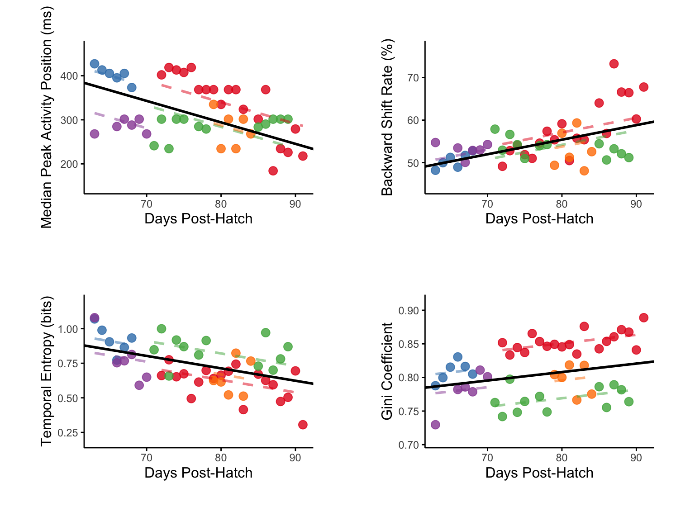
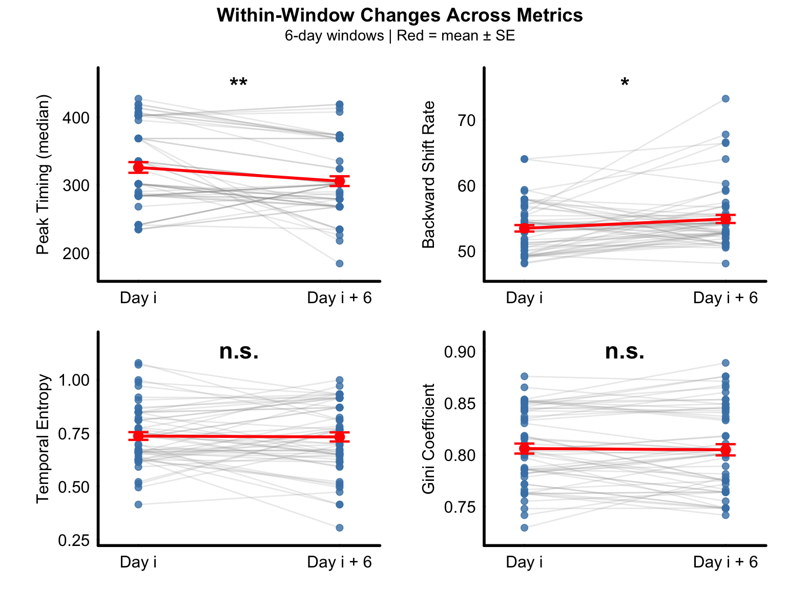
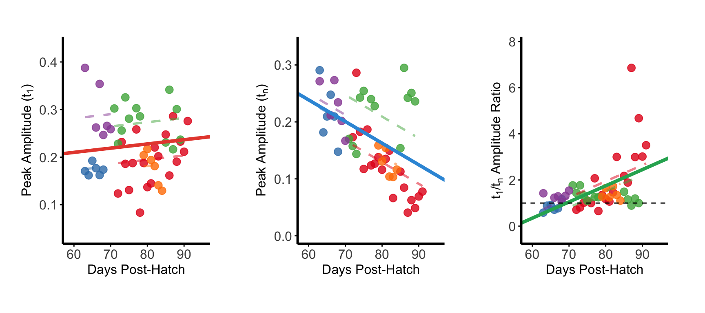
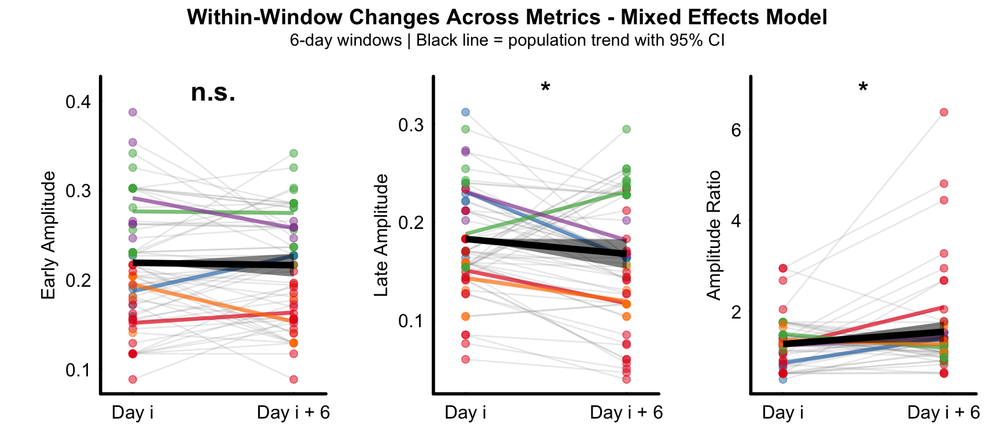
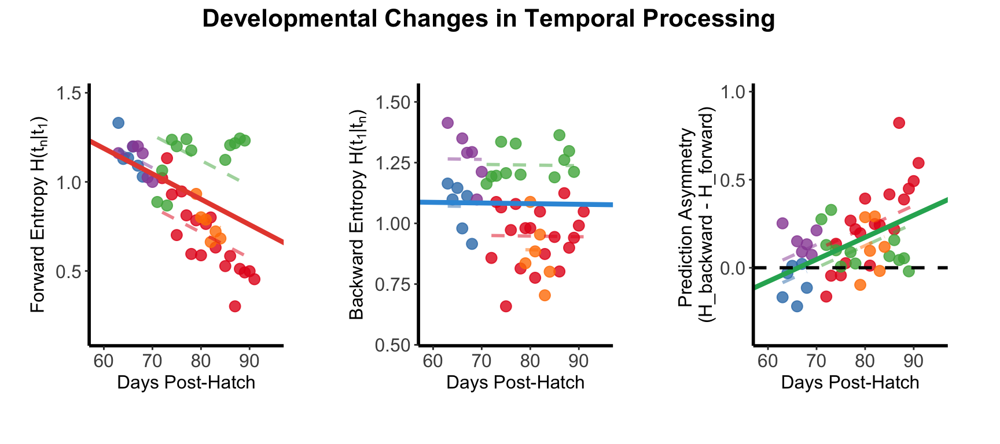
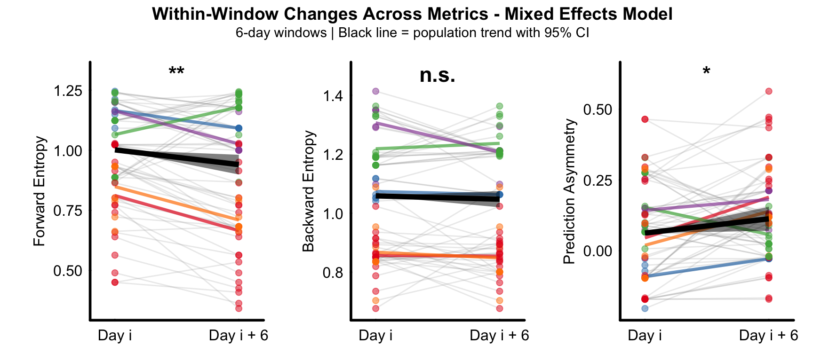

```{r setup, include = FALSE}
knitr::opts_chunk$set(echo = TRUE, warning = FALSE, message = FALSE)

# Global variable to control code evaluation and figure generation
EVAL <- FALSE  # Set to TRUE to switch to eval = TRUE, FALSE to use pre-generated images
```

\

## Overview

**This tutorial demonstrates population-level analysis of processed fiber photometry dopamine data from juvenile songbirds. The analysis examines temporal dynamics, amplitude shifts, and information flow patterns across multiple animals using the VNS package.**\
\

> ### Install Required Packages
>
> ```{r, install_pkgs, eval = FALSE}
> remotes::install_local(file.path(getwd(),"pkgs", "VNS_0.0.0.9000.tar.gz"),
>                       dependencies = TRUE)
> ```

## Load Package

```{r, load_pkgs, eval = EVAL}
library("VNS")
```

\

## Load Population Data

Load the population data created from the data processing and individual analysis pipeline.

```{r, load_data, eval = EVAL}
load("./data/population_data.rda")
```

\

## Pooling Workflow

This guide demonstrates how to generate population-level data by processing individual animal and combining them into a unified dataset. The workflow consists of four main steps:

### STEP 1: Load Individual NPM Object

```{r, step1, eval = FALSE}
npm <- readRDS("./data/npm_B633.rds")
```

\

### STEP 2: Compute Metrics for Individual Animals

For each animal, we calculate specific TD metrics (e.g., conditional entropy(cH))

```{r, step2, eval = FALSE}
B633_res <- npm |>
  create_segment_table(region ="reg0",
                       window = c(-0.4, 0.4),
                       n_segments= 4,
                       min_epoch = 50) |>
  analyze_directional_cH(source_seg = 1, target_seg = 4,
                         output ="data.frame")
```

\

### STEP 3: Iterate Across All Animals

Apply the same analysis pipeline to each animal in the dataset. This ensures consistent processing and comparable results across subjects.

\

### STEP 4: Combine Individual Results into Population Data

Pool all individual animal results into a single data frame. 
'combine_animal_results' function:
- Merges individual data frames
- Adds animal identifiers for tracking
- Preserves all computed metrics for population-level analysis

```{r, step4, eval = FALSE}
cH_res <- combine_animal_results(
  list(B633_res, P568_res, P569_res, R561_res,R562_res),
  c("B633", "P568", "P569", "R561", "R562")
)
```

\

## Temporal Shift

### Linear Mixed Effects Modeling

```{r, temporal_lmm, eval = EVAL}
td_res <- analyze_td_metrics(temporal_shift_res)
```

\

### Figure D-G

Population-level analysis of temporal difference learning metrics across vocal development.

Linear mixed-effects models (LMMs) showing developmental trajectories of dopamine transient characteristics (n = 49 observations from 5 birds, 63-91 dph). Median peak timing decreases with development (top-left). Backward shift rate increases with development (top-right). Temporal entropy decreases with development (lower-left). Gini coefficient increases with development (lower-right).

```{r, FigD-G, fig.width=8, fig.height=6, eval = EVAL}
plot_td_panel(temporal_shift_res,show_title = FALSE, show_annotations = FALSE)
```

```{r, img1, echo=FALSE, eval=!EVAL}

```
Each colored dot represents the mean value for one animal at a given age, with colors indicating individual animals.

Black lines show population-level fixed effects from LMMs with animal identity as random intercept.

\

### Within Window Analysis

```{r, within_window, eval = EVAL}
td_res2 <- analyze_within_window_trends(temporal_shift_res,
                                        test_method = "both",
                                        window_size = 6,
                                        plot_results = FALSE)
```

\

### Figure H-K

Paired comparison of temporal discrimination metrics between the first day (Day i) and last day (Day i + 6) of 6-day sliding windows across the experimental period. Median peak timing significantly decreased within windows (top-left). 

Backward shift rate significantly increased within windows (top-right). Temporal entropy showed no significant change within windows (lower-left). Gini coefficient showed no significant change within windows (lower-right).

```{r, FigH-K, fig.width=8, fig.height=6, eval = EVAL}
plot_paired_metric_panel(td_res2, window_size = 6,
                      metric_order = c("peak_timing","backward_shift",  "entropy", "gini"),
                      ncol = 2)
```

```{r, img2, echo=FALSE, eval=!EVAL}

```
Gray lines connect paired observations from individual animals within the same temporal window (n = 57 paired observations from 5 birds across 24 windows). 

Red lines and symbols indicate group means ± SEM. 

\

## Amplitude Shift

### Linear Mixed Effects Modeling

```{r, amplitude_lmm, eval = EVAL}
td_res3 <- analyze_amplitude_metrics(amplitude_shift_res)
```

\

### Figure N-P

Population analysis of amplitude shift pattern across all animals.

Early peak amplitude showed no significant developmental change across the population (left). Late peak amplitude significantly decreased with development (middle). Early/late amplitude ratio significantly increased across development (right).

```{r, FigN-P, fig.width=9, fig.height=4, eval = EVAL}
plot_amplitude_panel(amplitude_shift_res, show_title = FALSE, show_annotations = FALSE)
```

```{r, img3, echo=FALSE, eval=!EVAL}

```
Individual animals shown in different colors with fitted regression lines.

\

### Within Window Analysis

```{r, amplitude_within_window, eval = EVAL}
td_res4 <- analyze_within_window_trends2(amplitude_within_window_res,
                                         model ="mixed_effects",
                                         test_method = "both",
                                         window_size = 6,
                                         plot_results = FALSE)
```

\

### Supplemental Figure 1

Population-level within-window paired analysis using mixed-effects models across 6-day sliding windows. 

Early amplitude showed no significant within-window change (left). Late amplitude decreased significantly within windows (middle). Amplitude ratio increased significantly within windows (right).

```{r, Fig_sup3, fig.width=9, fig.height=4, eval = EVAL}
plot_paired_metric_panel2(td_res4, window_size = 6, ncol = 3)
```

```{r, img4, echo=FALSE, eval=!EVAL}

```
Points: individual observations colored by animal

Gray lines: individual observations within each window (animal × window combinations). 

Colored lines: mean trajectory for each animal across all windows. 

Black line with ribbon: population-level trend with 95% confidence interval from fixed effects.

\

## Information Analysis

### Linear Mixed Effects Modeling

```{r, info_lmm, eval = EVAL}
td_res5 <- analyze_cH_metrics(cH_res)
```

\

### Figure S-U

Population analysis of directional conditional entropy across all animals.

Forward conditional entropy significantly decreased with development (left), indicating population-level improvement in predictive capability from early to late temporal events.Backward conditional entropy showed no significant developmental change (middle). Prediction asymmetry significantly increased across development (right), with crossover from backward to forward dominance predicted at 66.2 dph.

```{r, FigS-U, fig.width=9, fig.height=4, eval = EVAL}
plot_cH_panel(cH_res)
```

```{r, img5, echo=FALSE, eval=!EVAL}

```
Individual animals shown in different colors with fitted regression lines. 
 
\

### Within Window Analysis

```{r, info_within_window, eval = EVAL}
td_res6 <- analyze_within_window_info_flow(cH_within_window_res,
                                          model ="mixed_effects",
                                          window_size = 6,
                                          plot_results = FALSE)
```

\

### Supplemental Figure 2

Population-level within-window paired analysis using mixed-effects models across 6-day sliding windows. 

Forward entropy decreased significantly within windows (left), indicating improved forward predictability. Backward entropy showed no significant within-window change (middle). Prediction asymmetry increased significantly within windows (right), demonstrating a shift toward forward prediction dominance.

```{r, Fig_sup4, fig.width=9, fig.height=4, eval = EVAL}
plot_paired_metric_panel2(td_res6, window_size = 6,  ncol = 3)
```

```{r, img6, echo=FALSE, eval=!EVAL}

```
Points: individual observations colored by animal. 

Gray lines: individual observations within each window (animal × window combinations).

Colored lines: mean trajectory for each animal across all windows. 

Black line with ribbon: population-level trend with 95% confidence interval from fixed effects.

\

## Save Results

```{r, save_results, eval = EVAL}
# Get all object names in the global environment
all_objects <- ls()

# Find objects that start with "td"
td_objects <- all_objects[grepl("^td", all_objects)]

# Save objects starting with "td" to results.rda
save(list = td_objects, file = "./data/results.rda")

# To review the results in a new session load("./data/results.rda")
```

\

## Summary

This population analysis:

1.  **Processed** individual animal data and combined into population datasets
2.  **Analyzed** temporal and amplitude dynamics across multiple animals using LMMs
3.  **Quantified** information flow and predictive coding development across multiple animals
5.  **Generated** comprehensive population-level statistical results
6.  **Saved** analysis results for further investigation\
    \

## Session Info

```{r, echo = FALSE}
sessionInfo()
```
