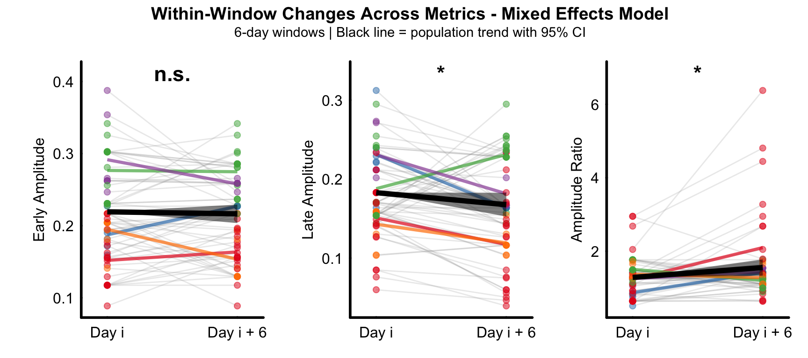

```{r setup, include = FALSE}
knitr::opts_chunk$set(echo = TRUE, warning = FALSE, message = FALSE)

# Global variable to control code evaluation and figure generation
EVAL <- FALSE

```

\

## Overview

**This tutorial demonstrates population-level analysis of processed fiber photometry dopamine data from juvenile songbirds using weighted Linear Mixed-effects Models (LMMs).**

\

## Why Use Weighted LMMs?

### The Unbalanced Data Problem

In longitudinal studies of songbird vocal development, it is common to have **unbalanced data** where:

- Some birds contribute more observations than others (e.g., due to recording success, animal health, or experimental constraints)
- The most-sampled individuals can become **dominant clusters** that disproportionately influence population-level estimates
- Standard LMMs with random effects account for within-subject correlation, but do not explicitly balance each animal's contribution to fixed effect estimates

**Example data:** If Bird A has 50 observations while Birds B and C each have 10, Bird A contributes 71% of the data but represents only 33% of the population. This can bias developmental trend estimates toward patterns seen only in the well-sampled individual.

### Available Weighting Methods

The VNS package provides three weighting approaches via the `balance_method` parameter:

| Method | Formula | When to Use |
|--------|---------|-------------|
| `"none"` | No weighting | Balanced data or when all observations are equally informative |
| `"inverse"` | weight = 1/n~obs~ | Heavily unbalanced sample sizes; ensures equal contribution per animal |
| `"sqrt_inverse"` | weight = 1/√n~obs~ | Moderate imbalance; partial equalization while preserving some sample size advantage |

\

### Why Inverse Weighting?

In this analysis, we use **inverse weighting** (`balance_method = "inverse"`) because:

1. **Sample Size Imbalance**: Our dataset has substantial variation in observations per animal
2. **Equal Representation**: Each animal should contribute equally to population-level developmental trends, regardless of how many data points were collected
3. **Avoid Dominant Clusters**: Without weighting, animals with more observations would disproportionately drive the fixed effect estimates

**How It Works:**

- Each observation is weighted by `1/n`, where `n` is the number of observations for that animal
- The sum of weights per animal equals 1, so all animals contribute equally to the model
- Well-sampled animals are downweighted; poorly-sampled animals are upweighted

\

### What Will Differ from Unweighted Analysis?

Using weighted LMMs may affect:

| Aspect | Potential Change |
|--------|------------------|
| **Fixed effect estimates** | May shift if over-sampled animals were biasing the trend |
| **Standard errors** | Often more appropriate (neither over- nor under-confident) |
| **P-values** | May become more or less significant depending on data structure |
| **Conclusions** | Generally more robust and generalizable to the population |
| **Figures** | Fitted lines may have different slopes; confidence intervals may change |

> **Note:** If unweighted and weighted analyses agree, this provides stronger evidence for the findings. Divergence warrants investigation of which animals drive the difference.

\

> ### Install Required Packages
>
> ```{r, install_pkgs, eval = FALSE}
> remotes::install_local(file.path(getwd(),"pkgs", "VNS_0.0.0.9001.tar.gz"),
>                       dependencies = TRUE)
> ```

## Load Package

```{r, load_pkgs, eval = EVAL}
library("VNS")
packageVersion("VNS") 
```

\

## Load Population Data

Load the population data created from the data processing and individual analysis pipeline.

```{r, load_data, eval = EVAL}
load("./data/population_data.rda")

# Weighting method for all analyses
BALANCE_METHOD <- "inverse"  # Options: "none", "inverse", "sqrt_inverse"
```

\

## Temporal Shift (Weighted LMM)

### Linear Mixed Effects Modeling with Inverse Weighting

```{r, temporal_lmm, eval = EVAL}
td_res <- analyze_td_metrics(temporal_shift_res, balance_method = BALANCE_METHOD)
```

\

### Figure D-G: Weighted LMM Analysis

Population-level analysis of temporal difference learning metrics across vocal development using **inverse-weighted LMMs** to balance individual contributions.

Weighted linear mixed-effects models showing developmental trajectories of dopamine transient characteristics (n = 49 observations from 5 birds, 63-91 dph). Median peak timing decreases with development (top-left). Backward shift rate increases with development (top-right). Temporal entropy decreases with development (lower-left). Gini coefficient increases with development (lower-right).

```{r, FigD-G, fig.width=8, fig.height=6, eval = EVAL}
plot_td_panel(temporal_shift_res, balance_method = BALANCE_METHOD,
              show_title = FALSE, show_annotations = FALSE)
```

```{r, img1, echo=FALSE, eval=FALSE}
knitr::include_graphics("figs/FigD-G.png")
```
Each colored dot represents the mean value for one animal at a given age, with colors indicating individual animals.

Black lines show population-level fixed effects from **inverse-weighted LMMs** with animal identity as random intercept. Inverse weighting ensures each animal contributes equally regardless of sample size.

\

## Amplitude Shift (Weighted LMM)

### Linear Mixed Effects Modeling with Inverse Weighting

```{r, amplitude_lmm, eval = EVAL}
td_res3 <- analyze_amplitude_metrics(amplitude_shift_res, balance_method = BALANCE_METHOD)
```

\

### Figure N-P: Weighted LMM Analysis

Population analysis of amplitude shift pattern across all animals using **inverse-weighted LMMs**.

Early peak amplitude showed no significant developmental change across the population (left). Late peak amplitude significantly decreased with development (middle). Early/late amplitude ratio significantly increased across development (right).

```{r, FigN-P, fig.width=9, fig.height=4, eval = EVAL}
plot_amplitude_panel(amplitude_shift_res, balance_method = BALANCE_METHOD,
                     show_title = FALSE, show_annotations = FALSE)
```

```{r, img3, echo=FALSE, eval=FALSE}
knitr::include_graphics("figs/FigN-P.png")
```
Individual animals shown in different colors with fitted regression lines. **Inverse weighting** balances contributions across animals.

\

### Within Window Analysis (Weighted)

```{r, amplitude_within_window, eval = EVAL}
td_res4 <- analyze_within_window_trends2(amplitude_within_window_res,
                                         model ="mixed_effects",
                                         balance_method = BALANCE_METHOD,
                                         test_method = "both",
                                         window_size = 6,
                                         plot_results = FALSE)
```

\

### Supplemental Figure 1: Weighted Within-Window Analysis

Population-level within-window paired analysis using **inverse-weighted mixed-effects models** across 6-day sliding windows. 

Early amplitude showed no significant within-window change (left). Late amplitude decreased significantly within windows (middle). Amplitude ratio increased significantly within windows (right).

```{r, Fig_sup3, fig.width=9, fig.height=4, eval = EVAL}
plot_paired_metric_panel2(td_res4, window_size = 6, ncol = 3)
```

```{r, img4, echo=FALSE, eval=FALSE}

```
Points: individual observations colored by animal

Gray lines: individual observations within each window (animal × window combinations). 

Colored lines: mean trajectory for each animal across all windows. 

Black line with ribbon: population-level trend with 95% confidence interval from **inverse-weighted** fixed effects.

\

## Information Analysis (Weighted LMM)

### Linear Mixed Effects Modeling with Inverse Weighting

```{r, info_lmm, eval = EVAL}
td_res5 <- analyze_cH_metrics(cH_res, balance_method = BALANCE_METHOD)
```

\

### Figure S-U: Weighted LMM Analysis

Population analysis of directional conditional entropy across all animals using **inverse-weighted LMMs**.

Forward conditional entropy significantly decreased with development (left), indicating population-level improvement in predictive capability from early to late temporal events. Backward conditional entropy showed no significant developmental change (middle). Prediction asymmetry significantly increased across development (right), with crossover from backward to forward dominance predicted at 66.2 dph.

```{r, FigS-U, fig.width=9, fig.height=4, eval = EVAL}
plot_cH_panel(cH_res, balance_method = BALANCE_METHOD)
```

```{r, img5, echo=FALSE, eval=FALSE}
knitr::include_graphics("figs/FigS-U.png")
```
Individual animals shown in different colors with fitted regression lines. **Inverse weighting** ensures equal representation per animal.
 
\

### Within Window Analysis (Weighted)

```{r, info_within_window, eval = EVAL}
td_res6 <- analyze_within_window_info_flow(cH_within_window_res,
                                          model ="mixed_effects",
                                          balance_method = BALANCE_METHOD,
                                          window_size = 6,
                                          plot_results = FALSE)
```

\

### Supplemental Figure 2: Weighted Within-Window Analysis

Population-level within-window paired analysis using **inverse-weighted mixed-effects models** across 6-day sliding windows.

Forward entropy decreased significantly within windows (left), indicating improved forward predictability. Backward entropy showed no significant within-window change (middle). Prediction asymmetry increased significantly within windows (right), demonstrating a shift toward forward prediction dominance.

```{r, Fig_sup4, fig.width=9, fig.height=4, eval = EVAL}
plot_paired_metric_panel2(td_res6, window_size = 6,  ncol = 3)
```

```{r, img6, echo=FALSE, eval=FALSE}
knitr::include_graphics("figs/Fig_sup4.png")
```
Points: individual observations colored by animal. 

Gray lines: individual observations within each window (animal × window combinations).

Colored lines: mean trajectory for each animal across all windows. 

Black line with ribbon: population-level trend with 95% confidence interval from fixed effects.

\

## Save Results

```{r, save_results, eval = FALSE}
# Get all object names in the global environment
all_objects <- ls()

# Find objects that start with "td"
td_objects <- all_objects[grepl("^td", all_objects)]

# Save objects starting with "td" to results.rda
save(list = td_objects, file = "./data/weighted_results.rda")

# To review the results in a new session load("./data/weighted_results.rda")
```

\

## Summary

This population analysis:

1.  **Processed** individual animal data and combined into population datasets
2.  **Analyzed** temporal and amplitude dynamics across multiple animals using LMMs
3.  **Quantified** information flow and predictive coding development across multiple animals
5.  **Generated** comprehensive population-level statistical results
6.  **Saved** analysis results for further investigation\
    \

## Session Info

```{r, echo = FALSE}
sessionInfo()
```
